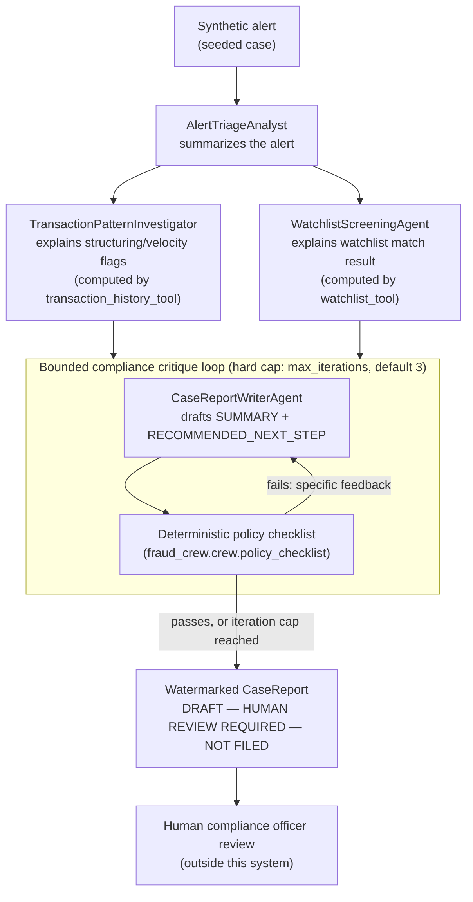
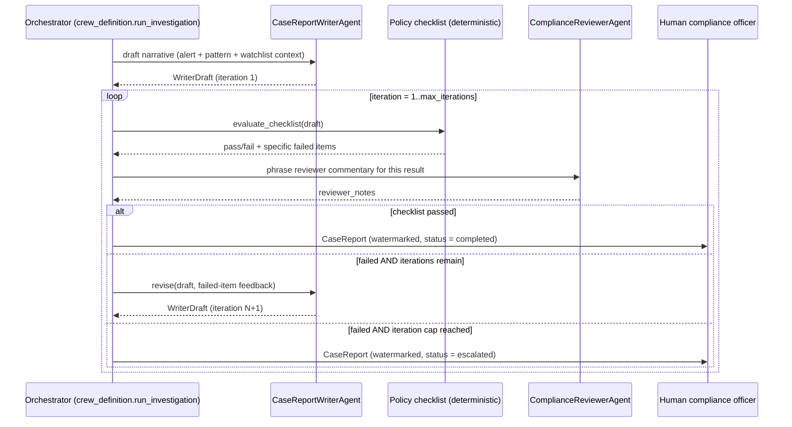

# Fraud & AML Investigation Crew: A CrewAI Multi-Agent System for Suspicious Activity Case Support

> ## ⚠️ Read this first
>
> **This is a decision-support DRAFTING tool only.** It does **not** file
> any real regulatory report of any kind, connect to any real filing
> system, or constitute legal, compliance, or regulatory advice. Every
> artifact it produces is explicitly watermarked
> `DRAFT — HUMAN REVIEW REQUIRED — NOT FILED` and **requires review and
> sign-off by a qualified human compliance officer before any action is
> taken on it.**
>
> This repository is just a **demo that mimick realities of everyday banking activities**. All bank names,
> account holders, transactiosn, and watchlist entries are **entirely
> fictional and synthetic**, generated for this project. The example bank,
> **"Northbridge Financial Group,"** is an invented brand that does not
> exist. Nothing here describes, references, or is derived from any real
> financial institution, regulation, sanctions list, or individual. See
> [GOVERNANCE.md](GOVERNANCE.md) for the full guardrail rationale.

---

## Why this exists

Banks increasingly needs to build reliable multi-agent systems. This project is a worked example of that: a
CrewAI multi-agent system that investigates a synthetic fraud/AML alert
end to end, with the guardrails a reviewer would actually look for --
deterministic fact-finding, a bounded human-in-the-loop critique cycle, a
mandatory draft watermark, and a full audit trail -- built in, not bolted
on. It is designed to run **entirely offline with zero paid API keys**, so
anyone can clone it and see the whole system work in under a minute.

## Architecture

Five CrewAI agents cooperate on one seeded synthetic case. Fact-finding
(transaction pattern flags, watchlist matches) is computed **deterministically
in plain Python**, not decided by an LLM -- the agents' job is to explain
those already-computed facts in plain language and draft a narrative. See
[Key Design Decisions](#key-design-decisions) for why.



The critique loop is the guardrail most worth looking closely at: pass/fail
is decided by a plain Python function evaluating a synthetic internal
policy checklist, never by asking the LLM to grade itself. The loop is
guaranteed to terminate -- either the checklist passes, or the iteration
cap is hit and the case is marked `escalated` for a human, but it never
spins indefinitely.



### The five agents

| Agent | Role |
|---|---|
| `AlertTriageAnalyst` | Summarizes the initial synthetic transaction-monitoring alert. |
| `TransactionPatternInvestigator` | Explains deterministic structuring/velocity flags via `TransactionHistoryTool`. |
| `WatchlistScreeningAgent` | Explains a deterministic synthetic watchlist screening result via `WatchlistScreeningTool`. |
| `ComplianceReviewerAgent` | Phrases commentary on the (deterministically computed) checklist pass/fail and requests specific revisions. |
| `CaseReportWriterAgent` | Drafts and revises the case narrative and recommended next step. |

## Key Design Decisions

1. **Facts are computed in code; the LLM only narrates.** Whether a
   transaction pattern looks like structuring, and whether a name matches
   the synthetic watchlist, are both plain, unit-tested Python functions
   (`fraud_crew/tools/*.py`), not LLM judgment calls. This makes the
   regulated-relevant facts reproducible regardless of model or sampling
   variance -- a real hosted LLM and the offline MockLLM produce identical
   structured findings, differing only in prose style. Tradeoff: the
   agents are "explainers" more than autonomous investigators for the
   fact-finding stage; a more research-flavored version could let a real
   LLM freely query the tools and synthesize novel hypotheses, at the cost
   of losing reproducibility.

2. **The critique loop is plain Python control flow, not a CrewAI
   `Process`.** CrewAI's built-in sequential/hierarchical processes don't
   expose a bounded "retry until a condition passes" primitive, and a
   guardrail whose termination depends on trusting the LLM to know when to
   stop is not a guardrail a bank would accept. `ComplianceCriticLoop`
   (`fraud_crew/crew/critique_loop.py`) is a small, directly unit-tested
   Python class with a `while` loop bounded by `max_iterations` -- the
   only way out is a `return`, reached deterministically.

3. **`MockLLM` dispatches on `from_agent.role`, not prompt text.** CrewAI's
   agent executor always passes `from_agent`/`from_task` objects into
   `BaseLLM.call()` (verified against the installed `crewai==1.15.9`
   internals). Using those directly, rather than regex-sniffing a
   rendered ReAct-style prompt, makes the offline mock robust to prompt
   template changes in future CrewAI versions.

4. **The API runs the crew synchronously.** `POST /cases/{id}/investigate`
   blocks until the crew finishes and returns the full result in one
   response. A MockLLM run completes in well under a second; a real-provider
   run is still latency-bounded by `LLM_REQUEST_TIMEOUT_SECONDS` and
   `tenacity`-backed retries. A higher-throughput deployment would enqueue
   the run and return `202 Accepted` immediately, using `GET
   /cases/{id}/report` to poll -- the route shape here already matches
   that future without being a breaking change (see
   [Roadmap](#roadmap--what-id-build-next)).

5. **State is in-memory, not a database.** The case store and audit log
   are process-local (a dict and an append-only JSONL file, respectively).
   That's the right complexity budget for a single-process demo service;
   see Roadmap for what a durable version would add.

## Governance & Guardrails

Full detail lives in [GOVERNANCE.md](GOVERNANCE.md). Summary:

- Every generated report carries a mandatory `DRAFT — HUMAN REVIEW
  REQUIRED — NOT FILED` watermark (`fraud_crew/domain/watermark.py`), with
  a defense-in-depth check (`CaseReport.require_watermark()`) called
  before the API ever serializes a report.
- Fact-finding (pattern flags, watchlist matches) is deterministic code,
  not an LLM decision.
- The compliance critique loop is hard-capped at `max_iterations` (default
  3, configurable via `MAX_COMPLIANCE_ITERATIONS`) and **always
  terminates** -- see `tests/test_critique_loop.py`, which drives the loop
  with an intentionally incomplete first draft and asserts termination
  within the cap.
- Every tool computation, agent hand-off, and critique iteration is
  recorded to an append-only audit log (`fraud_crew/infrastructure/audit_log.py`),
  keyed by `case_id`.
- Mock tool output (transaction/watchlist data) is treated as untrusted
  content in agent prompts, not instructions -- see agent backstories in
  `fraud_crew/crew/agents.py`.

## Getting Started

Requires **Python 3.11 or 3.12** (CrewAI's dependency tree does not yet
support 3.13+ cleanly at the time of writing). No API keys are required --
the crew runs against a deterministic offline `MockLLM` by default.

```bash
# 1. Clone and enter the repo
git clone <this-repo-url>
cd crewai-fraud-investigation-crew

# 2. Create a virtualenv and install everything (or: make install)
python3.11 -m venv .venv
source .venv/bin/activate            # Windows: .venv\Scripts\activate
pip install -r requirements.txt -r requirements-dev.txt
pip install -e .

# 3. (Optional) copy the env template -- leave keys blank to stay offline
cp .env.example .env

# 4. Run the test suite (fully offline, no network calls)
pytest -v
# or: make test

# 5. Start the API
uvicorn fraud_crew.api.main:app --reload
# or: make run

# 6. Exercise it
curl -X POST http://localhost:8000/cases/CASE-2026-0001/investigate
curl http://localhost:8000/cases/CASE-2026-0001/report
curl http://localhost:8000/healthz
curl http://localhost:8000/readyz
```

Two synthetic cases ship pre-seeded: `CASE-2026-0001` (a structuring-pattern
alert, no watchlist hit) and `CASE-2026-0002` (an unremarkable transaction
history, but a seeded synthetic watchlist hit). See
`src/fraud_crew/data/seed_cases.py`.

To point the crew at a real hosted model instead of MockLLM, set
`OPENAI_API_KEY` or `ANTHROPIC_API_KEY` in `.env` (see `.env.example`) --
no code changes required.

### One-command local dev

```bash
docker compose up --build
```

## Production Deployment

- **Docker**: `Dockerfile` is a multi-stage build (separate build/runtime
  stages), runs as a non-root user, and ships a `HEALTHCHECK` hitting
  `/healthz`. Build with `make docker-build` or `docker build -t
  fraud-aml-investigation-crew:local .`.
- **Kubernetes**: manifests under `deploy/k8s/` (`Deployment`, `Service`,
  `ConfigMap`) set resource requests/limits, liveness/readiness probes
  against `/healthz`/`/readyz`, a read-only root filesystem with a
  writable `/tmp` `emptyDir`, and dropped Linux capabilities.
- **OpenShift**: see [deploy/OPENSHIFT.md](deploy/OPENSHIFT.md) for the
  handful of SCC-related considerations (arbitrary UID assignment,
  restricted SCC compatibility, `Route` vs `Ingress`).
- **CI**: `.github/workflows/ci.yml` runs `ruff`, `mypy`, `pytest` (matrix
  across Python 3.11/3.12) and a Docker build on every push/PR -- entirely
  offline, no secrets required.
- **Configuration**: everything is environment-variable driven via
  `pydantic-settings` (`fraud_crew/infrastructure/config.py`); see
  `.env.example` / `deploy/k8s/configmap.yaml`.

### Observability

Each crew stage and tool call is wrapped in a lightweight tracing span
(`fraud_crew/infrastructure/tracing.py`) that emits structured JSON log
records with `span_name`, `case_id`, and `duration_ms`. This repo does not
ship a full OpenTelemetry/Prometheus stack (kept out to preserve the
"zero external services required" demo constraint), but the integration
path is direct:

- **Metrics**: add `prometheus-fastapi-instrumentator` to `main.py` for
  request-level metrics for free, and increment a
  `Counter`/`Histogram` per span name inside `tracing.span()` for
  crew-level metrics (task duration, critique-loop iteration counts,
  escalation rate) -- then scrape `/metrics` with Prometheus and build a
  Grafana dashboard on top.
- **Traces**: swap `tracing.span()`'s body for
  `opentelemetry-sdk`'s `tracer.start_as_current_span(name, attributes=...)`
  and add an OTLP exporter pointed at Grafana Tempo/Jaeger -- call sites
  elsewhere in the codebase would not need to change, since they only
  depend on `span()`'s context-manager interface.
- **Logs**: the JSON logs already emitted (`fraud_crew/infrastructure/logging.py`)
  are ready to ship to Grafana Loki (or any log aggregator) as-is.

## Tech Stack

| Layer | Technology |
|---|---|
| Agent orchestration | [CrewAI](https://github.com/crewAIInc/crewAI) 1.15.x (`Agent`, `Task`, `Crew`, custom `BaseLLM`) |
| Offline LLM fallback | Hand-rolled deterministic `MockLLM` (no external calls, no API keys) |
| API | FastAPI + Uvicorn |
| Data validation | Pydantic v2 / pydantic-settings |
| Resilience | `tenacity` (retry + exponential backoff with jitter on real-provider LLM calls) |
| Testing | pytest, pytest-asyncio, FastAPI `TestClient` |
| Lint / types | ruff, mypy |
| Containerization | Docker (multi-stage, non-root), docker-compose |
| Orchestration (prod) | Kubernetes manifests / OpenShift-compatible |
| CI | GitHub Actions |

## Repository Structure

```
crewai-fraud-investigation-crew/
├── src/fraud_crew/
│   ├── api/                  # FastAPI app, routes, request/response schemas, in-memory case store
│   ├── crew/                 # Agent construction, task descriptions, critique loop, orchestration entrypoint
│   ├── tools/                # CrewAI BaseTool subclasses + the deterministic functions they wrap
│   ├── domain/                # Pydantic models: alert, transaction, watchlist, compliance, report, errors, watermark
│   ├── data/                  # Seeded synthetic cases + synthetic watchlist (fictional data only)
│   └── infrastructure/        # config, structured logging, tracing spans, audit log, LLM factory (real/Mock)
├── tests/                      # Unit tests: tools, policy checklist, critique loop, watermark, API
├── deploy/
│   ├── k8s/                    # Deployment / Service / ConfigMap manifests
│   └── OPENSHIFT.md
├── .github/workflows/ci.yml    # lint, type-check, test, docker build
├── Dockerfile                  # multi-stage, non-root, pinned base image
├── docker-compose.yml
├── Makefile                    # install / test / lint / run
├── pyproject.toml / requirements*.txt
├── GOVERNANCE.md
├── SECURITY.md
├── CONTRIBUTING.md
└── LICENSE (MIT)
```

## Roadmap / What I'd Build Next

- **Async execution + a real task queue** (Celery/RQ or an async
  in-process queue) so `POST /investigate` returns `202 Accepted`
  immediately for higher-volume or slower (real-LLM) workloads.
- **Durable storage** for the case store and audit log (Postgres +
  SQLAlchemy) instead of in-memory/JSONL, with proper migration tooling.
- **Real OpenTelemetry + Prometheus/Grafana wiring**, replacing the
  lightweight span logger with actual exporters (see Observability above).
- **AuthN/AuthZ** on the API (OAuth2 client-credentials or mTLS, matching
  how a bank's internal gateway would front this service) -- currently
  unauthenticated, which is appropriate only for local/demo use.
- **A richer synthetic dataset** (more seeded cases, adversarial/near-miss
  watchlist names, multi-account structuring patterns) to stress-test the
  critique loop's checklist further.
- **Pluggable checklist definitions** (load the synthetic policy checklist
  from config/YAML rather than hardcoded Python) so the "what counts as a
  complete draft" logic is reviewable by non-engineers.
- **Human-in-the-loop UI** -- even a minimal reviewer screen that renders
  a `CaseReport`, its audit trail, and an approve/reject action, to make
  the "human sign-off" step in Governance concrete rather than implied.


  ---


### Thank you for reading

#### Please consider giving a star if you find the repo useful. Thank you.

---

### **AUTHOR'S BACKGROUND**
### Author's Name:  Emmanuel Oyekanlu
```
Skillset:   I have experience spanning several years in data science, enterprise AI architecture and solutions, developing scalable enterprise data pipelines,
enterprise solution architecture, architecting enterprise systems data and AI applications,
software and AI solution design and deployments, data engineering, industrial intelligent vision systems, high performance computing (GPU, CUDA), machine learning,
NLP, Agentic-AI and LLM applications as well as deploying scalable solutions (apps) on-prem and in the cloud.

I can be reached through: manuelbomi@yahoo.com

Publications:  https://scholar.google.com/citations?user=S-jTMfkAAAAJ&hl=en
LinkedIn:  https://www.linkedin.com/in/emmanuel-oyekanlu-6ba98616
Github:  https://github.com/manuelbomi

```
[](https://skillicons.dev)


